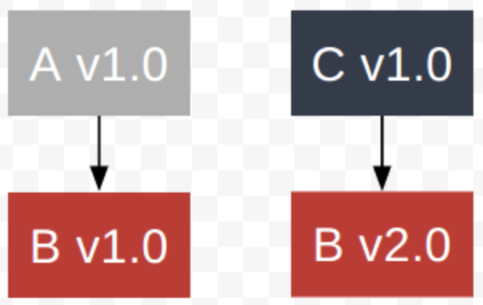
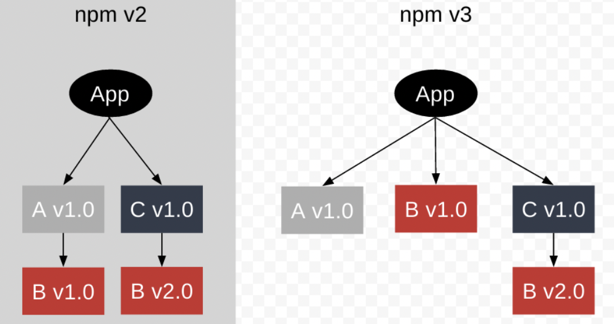
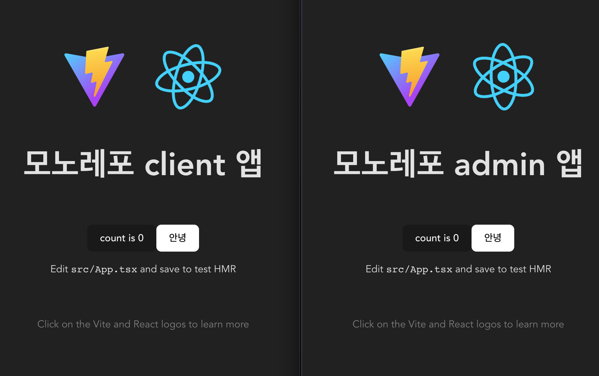

# 패키지 매니저 및 모노레포

- [패키지 매니저 및 모노레포](#패키지-매니저-및-모노레포)
- [패키지 매니저](#패키지-매니저)
  - [📌 서론.](#서론)
    - [📚 하는 것들](#하는-것들)
  - [📌 문제점](#문제점)
    - [📚 의존성 지옥](#의존성-지옥)
  - [📌 NPM](#npm)
    - [📚 특징](#특징)
    - [📚 보안](#보안)
  - [📌 YARN Classic](#yarn-classic)
    - [📚 특징](#특징-1)
    - [📚 단점](#단점)
    - [📚 보안](#보안-1)
  - [📌 PNPM](#pnpm)
    - [📚 특징](#특징-2)
    - [📚 보안](#보안-2)
  - [📌 YARN BERRY](#yarn-berry)
    - [📚 특징](#특징-3)
    - [📚 보안](#보안-3)
  - [📌 참고자료.](#참고자료)
- [모노레포](#모노레포)
  - [📌 서론](#-서론)
  - [📌 모노레포](#-모노레포)
    - [📚 도입 배경](#-도입-배경)
    - [📚 모노레포 시스템 선택](#-모노레포-시스템-선택)
  - [📌 모노레포 테스트 구성](#-모노레포-테스트-구성)
    - [**STEP1 pnpm 세팅**](#step1-pnpm-세팅)
    - [**STEP2 pnpm workapce 세팅**](#step2-pnpm-workapce-세팅)
    - [**STEP3 모노레포 앱 세팅**](#step3-모노레포-앱-세팅)
    - [**STEP4 공용으로 사용할 패키지 세팅**](#step4-공용으로-사용할-패키지-세팅)
    - [**STEP5 앱에서 패키지 가져다가 사용하기**](#step5-앱에서-패키지-가져다가-사용하기)
    - [**결과물**](#결과물)
  - [📌 자주사용하는 pnpm workspace cli](#-자주사용하는-pnpm-workspace-cli)
    - [`install` vs `add`](#install-vs-add)
    - [--filter](#--filter)
    - [--workapce](#--workapce)
    - [-r, --parallel](#-r---parallel)
  - [📌 참고](#-참고)
    - [tip](#tip)
    - [링크](#링크)

# 패키지 매니저

## 📌 서론.

### 📚 하는 것들

- 메타데이터 처리 및 쓰기 (package.json)
- 의존성 관리 (node_modules)
- 스크립트 관리 (사용자 지정 스크립트)
- 보안 검사

## 📌 문제점

### 📚 의존성 지옥

- NPM에 올라온 노드 모듈들(패키지)들이 있으며,
  해당 패키지들 서로서로 의존관계를 가질 수 있음.
  만약 A패키지와 B패키지 둘 다,
  C패키지에 의존하고 있다면 어떻게 관리해야할까
- 앱은 A와 C 패키지가 필요하며,
  두 패키지는 각각 다른 버전의 B 패키지가 필요해
  
  ⇒ 앱은 **어떻게 B 패키지를 설치**해야할까?

## 📌 NPM

- 가장 기본적인 Node Package Module
- NPM V2 와 V3 가 패키지의 의존성 문제를 해결하는 방법은 달라
  
  - NPM2 에서는 의존 관계에 있는 모듈을 해당 모듈 아래에 둠
    - 이 경우, 동일한 패키지에 대한 여러 중복 폴더가 생겨버릴 수 있음
  - NPM3 에서는 모든 모듈을 Flat 하게 두지만 (호이스팅),
    특정 모듈에서 이미 설치된 모듈과 다른 버전이 필요하면,
    그 모듈 아래에 둠
    ⇒ 해당 방식에서는 “내컴되, 니컴안 “ 현상이 발생할 수 있음 (에러 찾기 어려움)
    ⇒ 모듈을 설치하는 순서에 따라, 의존성 구조가 달라지는 문제가 생김

### 📚 특징

- 패키지들을 순차적으로 설치하여 느림
- 전통적인 중첩된 node_modules와 관련한 보안적인 문제 있음

### 📚 보안

- package-lock.json의 SHA-512 암호화 알고리즘을 사용해서 설치하는 패키지의 무결성을 체크함

## 📌 YARN Classic

[공식 홈페이지](https://yarnpkg.com/)

- 페북 구글 등이 공동 작업

### 📚 특징

- NPM3 의 Flat한 의존성 구조를 가짐 (호이스팅)
- 네이티브 모노레포 지원
- 캐시 설치
- 오프라인 캐싱
  - 오프라인 미러 활용으로 오프라인에서도 패키지 설치 가능
- lock 파일
  - yarn.lock 파일을 자동 생성하고 의존 모듈을 순서대로 적어둠
    ⇒ 잠금 파일의 장점으로 특정 버저만 설치가 가능
- 패키지 병렬적으로 설치

### 📚 단점

- Flat한 의존성 트리
  - 한 의존성 트리를 만드는 알고리즘 비용이 큼
  - 유령 의존성 문제가 있음

\*유령 의존성: 의존성과 관련하여 사용하겠다고 명시한 패키지 뿐아니라, 의존 관계에 있는 패키지도 가져다가 사용할 수 있게 되버림 ⇒ 만약에 해당 패키지가 삭제되버리면, 에러가 발생할 수 있음

### 📚 보안

- yarn.lock에 저장된 체크섬으로 각 패키지의 무결성을 검증
- 설치 중에 package.json에 선언되지 않은 악성 패키지를 검색하지 못하도록 함

## 📌 PNPM

- [공식 홈페이지](https://pnpm.io/)
- yarn과 npm 보다 빠르고 디스크 효율성이 뛰어남
  - npm과 yarn 의 문제는 프로젝트 전체에서 사용되는 의존성에 의해 중복되는 파일
  - 패키지를 복사해서 사용하지 않고, **hard link(심링크)**를 사용하기 때문
  - 공간도 덜 차지해

### 📚 특징

- Content-addressable Storage
  - 홈 폴더(/.pnpm-storage)의 전역 저장소에 패키지를 저장하는 중첩된 node_modules 폴더가 생성됨
  - 패키지 버전 하나는 한 개의 복사본만 존재
    - 해당 파일의 링크를 프로젝트의 node_modules 폴더에 추가함
    - if axios를 사용하면 프로젝트가 100개 라면,
      npm 이나 yarn 은 100개의 axios 폴더를 가짐.
      ⇒ pnpm에서는 하나의 폴더만 가짐
      한번만 설치하고, 다른 플젝 100개에 심링크로 연결함
- npm에 대한 Drop-in Replacement로
  npm 프로젝트가 있으면 바로 pnpm을 바로 사용할 수 있음

* Drop-in Replacement: 별다른 설정없이 새로운 구성요소로 변경 가능 한 것

- NPM2 가 사용한 의존성 구조를 가짐
  - express 를 사용하면 node_modules 폴더에 express 폴더만 생김
  - 만약 yarn이나 npm이라면 다른 의존성 패키지들도 같이 node_modules 폴더에 생김
  - 단, node_modules/.pnpm 폴더에 의존 관계에 있는 패키지들이 생성됨

### 📚 보안

- 모든 패키지의 무결성 체크를 위한 체크섬 검사
- npm과 yarn classic은 호이스팅으로 인한 보안 문제가 있었음
  pnpm은 호이스팅을 사용하지 않아 이를 회피
- npm2 의 의존성 구조를 가지기 때문에,
  중첩된 node_modules 폴더를 생성하고,
  이는 의존성이 package.json에 명시적으로 선언된 패키지만 사용할 수 있음

## 📌 YARN BERRY

- [공식 홈페이지](https://yarnpkg.com/)
- yarn 2 라고 봐도 됨
- node_modules 폴더에 특정 패키지를 찾을 때, 모든 패키지를 돌아다니면서 해당 패키지가 있는지 찾아야함 (비효율적)
  - 패키지 설치 시에 비용이 큰 IO 작업이 발생함
  - package.json에 빠진 패키지의 경우,
    개발시에는 잘 작동하다가,
    프로덕션에서 시스템이 깨지는 경우가 발생하기도 함
  - 위 문제(node가 패키지를 찾도록 도와주는 것)를 해결하고자 Plug’n’Play 탄생

### 📚 특징

- Plug’n’Play (PnP)
  - node_modules 을 생성하지만, 의존성 조회 테이블이 있는 .pnp.cjs 파일 생성
    - 중첩된 폴더 구조가 아닌 파일이기 때문에,
      보다 효율적인 처리 가능
  - 모든 패키지는 .yarn/cahce/ 에 zip 파일로 저장됨
  - 해당 파일에는 관련된 패키지 이름과 버전, 위치, 의존성 리스트 등이 적혀 있음
  - Yarn berry 는 Node 에게 “너가 찾는 패키지 여기 있음! 이라고 알려줄 수 있음”
  - Yarn berry 에서는 다수의 파일(node_modules)을 설치하지 않고,
    한개의 텍스트 파일(.pnp.cjs)을 만들면 됨
    ⇒ 실제 파일은 zip 형태로 yarn/cache 에 저장함

### 📚 보안

- Yarn Classic과 유사함
- PnP모드로 작동할 경우, 전통적인 node_modules 접근 방식의 보안 문제를 겪지 않음
  - package.json에 명시된 의존성 바이너리만 실행할 수 있음

## 📌 참고자료.

- [https://medium.com/zigbang/패키지-매니저-그것이-궁금하다-5bacc65fb05d](https://medium.com/zigbang/%ED%8C%A8%ED%82%A4%EC%A7%80-%EB%A7%A4%EB%8B%88%EC%A0%80-%EA%B7%B8%EA%B2%83%EC%9D%B4-%EA%B6%81%EA%B8%88%ED%95%98%EB%8B%A4-5bacc65fb05d)
- [https://imch.dev/posts/pnpm-a-manager-what-is-not-flat/](https://imch.dev/posts/pnpm-a-manager-what-is-not-flat/)

<hr />

# 모노레포

## 📌 서론

- 모노레포란 하나의 저장소에서 여러 프로젝트를 관리하는 개발 전략
- 다수의 애플리케이션에서 공통으로 사용하는 라이브러리 관리 가능
- 일관된 DX 제공
- 프로젝트 별 작업 진행 사항 공유 가능
- 의존적인 프로젝트들의 개발 비용 감소

## 📌 모노레포

### 📚 도입 배경

- 프로젝트 계획 단계에서 3가지의 clinet 프로젝트가 필요했음
  - 각각의 client는 동일한 컴포넌트와 로직을 가질 것으로 예상됨
  - 단기간에 MVP 버전이 나와야하는 상황
- 새로운 기술의 도입
  - 프로젝트의 결과물도 중요하지만, 단순히 퍼블리싱 프로젝트를 진행하는 것이 꺼려졌음
  - 모노레포를 포함한 낯선 기술을 적극적으로 활용해보기로 했음
- 목표로하는 회사에서 활용 중인 모노레포
  - 네카라쿠배당토구애 등 유명한 IT기업에서는 모노레포로 다수의 프로젝트를 관리하고 있음
  - 실무에서의 적응기간을 줄일 수 있지 않을까라는 기대

### 📚 모노레포 시스템 선택

- 결과적으로 pnpm을 선택하였음. 그 이유는 하기와 같음
- npm을 Drop-in Replace 할 수 있는 pnpm 이었음
  - 팀원들의 학습 부하를 낮출 수 있을 것으로 기대
- yarn workspaces에서는 아직은 hoisting 관련 불안정한 이슈가 있음 [배민 기술 블로그에서 발견한 문제점](https://techblog.woowahan.com/7976/)
  - 단, Zero-Install을 제공하는 장점이 있어 추후 pnpm과 비교해보면 좋을 듯 함
- 심링크의 활용으로 불필요한 IO 과정이 없어 SSD 수명에 유리하고, 속도가 상대적으로 빠름
  - 내 맥북은 소중하니깐...
- 의존성에 대한 캐싱기능 제공 [링크 참고](https://pnpm.io/6.x/continuous-integration)
  - CI 환경에서의 보다 빠른 배포 속도 기대

## 📌 모노레포 테스트 구성

### **STEP1 pnpm 세팅**

pnpm의 설치되어 있지 않을 경우 아래와 같이 전역에 pnpm설치

```bash
npm install -g pnpm
// or sudo npm install -g pnpm
```

pnpm을 통한 모노레포 시작

```bash
  pnpm init
```

위 과정을 통해 기본적은 pnpm 프로젝트 세팅 완료

package.json 에 packageManager 버전 및 workspaces 설정

```json
{
  "workspaces": ["packages/*"],
  "packageManager": "pnpm@7.26.0",
  "devDependencies": {
    "pnpm": "^7.26.0"
  },
  "private": true
}
```

### **STEP2 pnpm workapce 세팅**

pnpm에서 제공하는 모노레포를 활용하기 위해 workspace 세팅

```yaml
# pnpm-workspace.yaml
packages:
  - 'packages/*'
  // or 'packages/**' for all subdirectories
```

위 세팅은 `packages` 폴더 내의 모든 폴더를 workspace로 인식하도록 세팅하는 과정

테스트용 모노레포에서는 `client`앱과 `admin` 두 앱이 하나의 모노레포로 구성되면,
`shared-ui` 패키지를 공용으로 사용할 수 있도록 세팅할 예정

다음과 같은 폴더 트리 구조를 가지도록 세팅

```bash
.
├── packages/
│   ├── app
│   │   ├── client
│   │   └── admin
│   └── shared-ui
├── package.json
├── pnpm-lock.yaml
└── pnpm-workspace.yaml
```

### **STEP3 모노레포 앱 세팅**

`packages/app/client` 와 `packages/app/admin`폴더로 이동하여 각각의 react 프로젝트 세팅

```bash
  pnpm create vite
```

### **STEP4 공용으로 사용할 패키지 세팅**

`packages/shared-ui` 폴더로 이동하여 공용으로 사용할 패키지 세팅

해당 패키지는 리액트 컴포넌트를 제공하는 패키지로 활용될 것이기 때문에,
리액트를 의존성에 추가

```bash
  # 하기 명령어는 shared-ui에만 react 의존성을 추가하겠다는 의미
  pnpm add --filter shared-ui react
```

생성된 리액트 컴포넌트 패키지에서 모노레포 앱에서 호출 당할 수 있도록,
적절한 패키지 이름 작성

```json
// packages/shared-ui/package.json
{
  "name": "@mono-fe/shared-ui",
  "main": "index.js",
  "types": "index.d.ts",
  "files": ["index.js", "index.d.ts"],
  "dependencies": {
    "react": "^18.2.0"
  }
  // ~~
}
```

`shared-ui` 패키지에서 제공할 `Button` 컴포넌트를 구현
일반 재사용 가능한 리액트 컴포넌트와 동일하게 구현

```tsx
// packages/shared-ui/components/Button.tsx
import React from 'react';
import type { FC, PropsWithChildren } from 'react';

interface Props extends PropsWithChildren {}

const Button: FC<Props> = ({ children }) => {
  return <button style={{ backgroundColor: 'white' }}>{children}</button>;
};

export default Button;
```

해당 패키지 전체를 관리하는 `index`에서 Button 컴포넌트를 export

```tsx
export { default as Button } from './components/Button';
```

### **STEP5 앱에서 패키지 가져다가 사용하기**

전체 프로젝트에 대한 의존성 설치 진행하기

```bash
  # 프로젝트 루트 폴더에서
  pnpm install
```

`client` 및 `admin` 앱에서 `shared-ui` 패키지를 가져다가 사용하기

```bash
  pnpm add @mono-fe/shared-ui --filter client --workspace
  pnpm add @mono-fe/shared-ui --filter admin --workspace
```

위 결과물로 각각의 프로젝트에 다음과 같은 의존성이 추가됨

```json
// packages/app/client/package.json
{
  "dependencies": {
    "@mono-fe/shared-ui": "workspace:*"
  }
}
```

프로젝트에서 해당 Button을 사용하기 위해, 각각의 앱에서 `shared-ui` 패키지를 가져다가 사용

```tsx
import { Button } from '@mono-fe/shared-ui';
// ~~
<Button>Click me</Button>;
// ~~
```

프로젝트 구동을 위한 srcipt

```json
  // fe-mono/package.json
  "scripts": {
    "start:dev": "pnpm --stream -r run start:dev",
  }

  // 각각의 앱에 대한 package.json
  "scripts": {
    "start:dev": "vite",
  }

```

이후 프로젝트 root 폴더에서 pnpm start:dev

### **결과물**



## 📌 자주사용하는 pnpm workspace cli

### `install` vs `add`

- install:

  - [링크 참고](https://pnpm.io/ko/next/cli/install)
  - 프로젝트 내 모든 의존성 패키지들을 설치하는데에 사용
  - `pnpm-lock` 파일을 토대로 의존성 설치
  - CI 환경에서, lockfile이 있지만 업데이트가 필요한 경우 설치가 실패

- add: 특정 패키지에 대한 의존성 설치
  - [링크 참고](https://pnpm.io/ko/next/cli/add)
  - 새로운 의존성을 설치하고자 할때 사용
  - 패키지와 패키지가 의존하는 모든 패키지를 설치

### --filter

- `client`프로젝트의 `start:dev`를 실행

```bash
  pnpm --filter client start:dev
```

- `client`프로젝트에만 의존성 설치

```bash
  pnpm add 패키지명 --filter client
```

### --workapce

- 동일한 저장소에 있는 패키지에 대한 의존성을 설치할때 사용
  (remote 저장소에 있다는게 아니라는 뜻)

```bash
  pnpm add 패키지명 --filter client --workspace
```

### -r, --parallel

- workspace에 있는 모든 패키지들에 대해 명령어를 재귀적으로 실행

```bash
  pnpm -r start:dev
```

- 병렬로 실행

```bash
  pnpm -r --parallel start:dev
```

## 📌 참고

### tip

- `pnpm`에서 제공하는 기본적인 모노레포의 기능이 부족한 경우,
  `nx`를 활용하여 개선할 수 있음

- 전역적으로 `lint` 등의 컨벤션 세팅이 가능함

### 링크

- [Setup a Monorepo with PNPM workspaces and speed it up with Nx!](https://blog.nrwl.io/setup-a-monorepo-with-pnpm-workspaces-and-speed-it-up-with-nx-bc5d97258a7e#d69f)
- [Managing a full-stack, multipackage monorepo using pnpm](https://blog.logrocket.com/managing-full-stack-monorepo-pnpm/)
- [Yarn berry workspace를 활용한 프론트엔드 모노레포 구축기](https://techblog.woowahan.com/7976/)
- [모두 알지만 모두 모르는 package.json](https://programmingsummaries.tistory.com/385)
